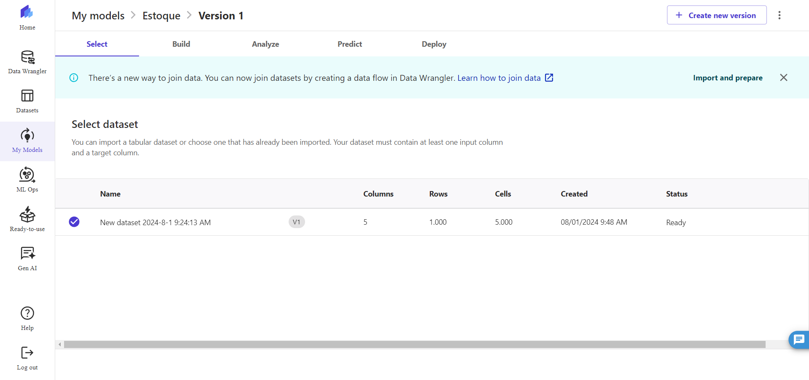
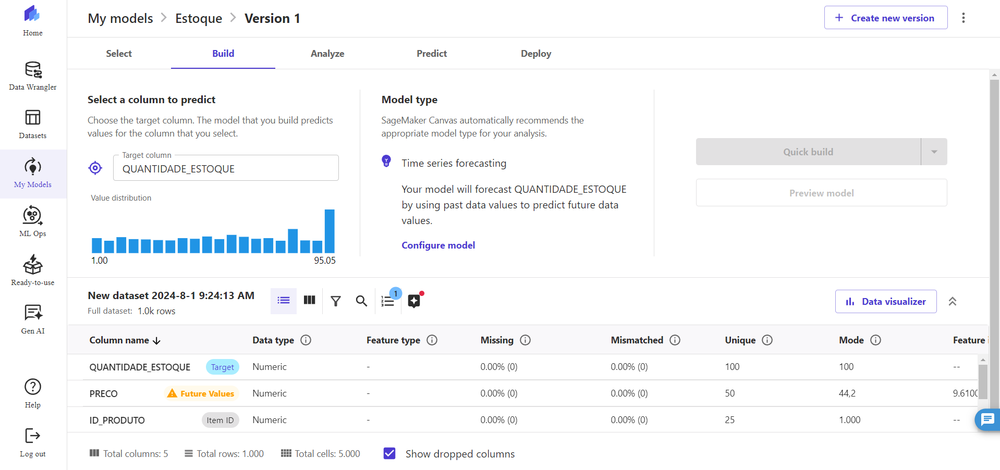
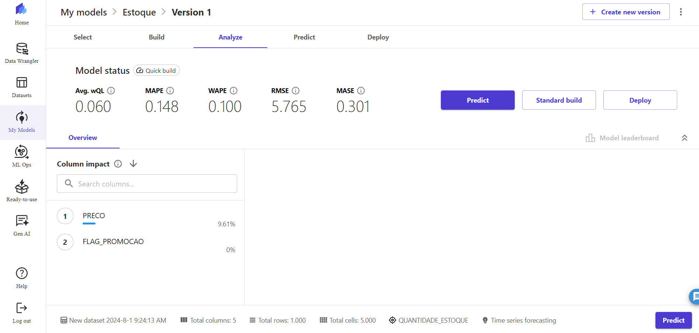
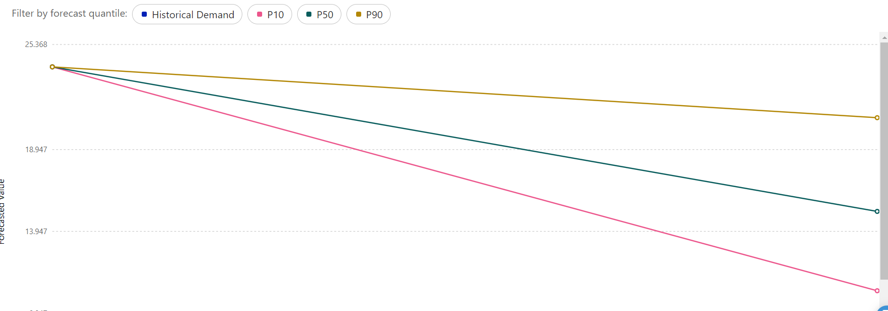

# 📊 Previsão de Estoque Inteligente na AWS com [SageMaker Canvas](https://aws.amazon.com/pt/sagemaker/canvas/)

Bem-vindo ao desafio de projeto "Previsão de Estoque Inteligente na AWS com SageMaker Canvas. 

## 🚀 Passo a Passo (Desafio de Projeto):

**1. Selecionando Dataset** [link]https://github.com/aalmeidamkt/lab-aws-sagemaker-canvas-estoque/blob/main/datasets/dataset-1000-com-preco-promocional-e-renovacao-estoque.csv:
O conjunto de dados utilizado para esse projeto para o treinamento da ML foi disponibilizado no próprio repositório da DIO em datasets.

**2. Construindo e Treinando:**

* Agora faremos algumas configurações definindo o QUANTIDADE_ESTOQUE como targete o ID_PRODUTO como ITEM ID.
* Treinei esse modelo no modo Quick Build.

**3. Analisando**

**4. Prevenir**

* Usando o modelo treinado, podemos ver o resultado final das variações geradas.

P10 LINHA ROSA (Reflete um cenário pessimista)

P50 LINHA VERDE(Reflete um cenário neutro)

P90 LINHA AMARELO(Reflete um cenário otimista)

